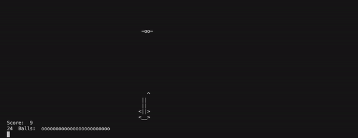

# space-shooter-game
- a space shooter game, in which the user has to shoot at and hit incoming spaceships with balls
# Space shooter game demo

# what works so far
- animating of shooter moving, balls, and arrows
- seperate algorithms for moving ball up
- shooting to add arrow
- detects when ball is hit by an arrow
- randomized position of spaceship
# what is to be done
- scoreboard
